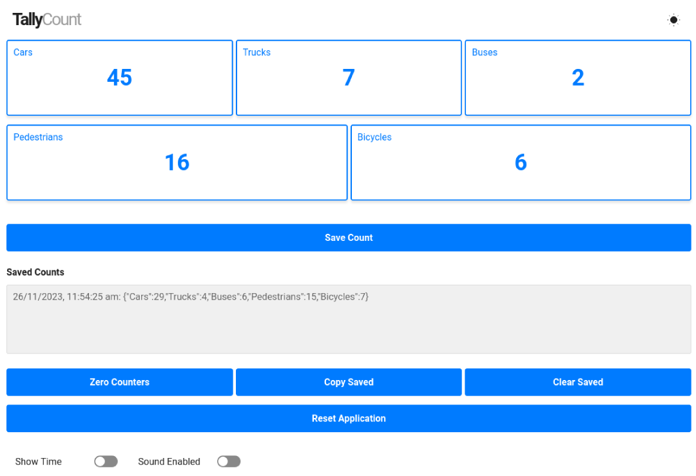

# TallyCount

TallyCount is a mobile-friendly digital tally counter tool written in HTML, CSS, and JavaScript. Whether you're tallying people, items, or conducting surveys, this easy-to-use tool has you covered. 

## Features

- **Named Counters:** Easily assign custom names to your counters for better organization.
- **Save Functionality:** Save your counts and resume them later, making it convenient for long-term projects.
- **Sound Toggle:** Customise your experience by enabling or disabling button click sounds.
- **Digital Clock:** Keep track of time while counting with the built-in clock.
- **Responsive Design:** Enjoy a seamless experience on both desktop and mobile browsers.

## How to Use

1. Enter a counter name in the "Enter counter name" field.
2. Click "Add Counter" to create a new counter.
3. Add additional counters as required and then click "Done" to start counting.
5. Increment counts by clicking on the counters.
6. Save counts, clear saved counts, and perform other actions using the provided buttons.

